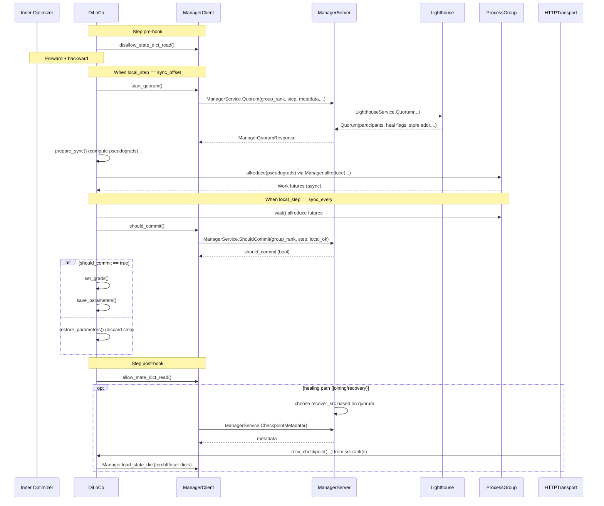

```mermaid
sequenceDiagram
  participant InnerOpt as Inner Optimizer
  participant DiLoCo as DiLoCo
  participant MgrC as ManagerClient
  participant MgrS as ManagerServer
  participant LH as Lighthouse
  participant PG as ProcessGroup
  participant HTTP as HTTPTransport

  Note over DiLoCo,MgrC: Step pre-hook
  DiLoCo->>MgrC: disallow_state_dict_read()

  Note over InnerOpt,DiLoCo: Forward + backward

  Note over DiLoCo,MgrC: When local_step == sync_offset
  DiLoCo->>MgrC: start_quorum()
  MgrC->>MgrS: ManagerService.Quorum(group_rank, step, metadata,...)
  MgrS->>LH: LighthouseService.Quorum(...)
  LH-->>MgrS: Quorum(participants, heal flags, store addr,...)
  MgrS-->>MgrC: ManagerQuorumResponse
  DiLoCo->>DiLoCo: prepare_sync() (compute pseudograds)
  DiLoCo->>PG: allreduce(pseudograds) via Manager.allreduce(...)
  PG-->>DiLoCo: Work futures (async)

  Note over DiLoCo,PG: When local_step == sync_every
  DiLoCo->>PG: wait() allreduce futures
  DiLoCo->>MgrC: should_commit()
  MgrC->>MgrS: ManagerService.ShouldCommit(group_rank, step, local_ok)
  MgrS-->>MgrC: should_commit (bool)

  alt should_commit == true
    DiLoCo->>DiLoCo: set_grads();
    DiLoCo->>DiLoCo: save_parameters();
  else
    DiLoCo->>DiLoCo: restore_parameters() (discard step)
  end

  Note over DiLoCo,MgrC: Step post-hook
  DiLoCo->>MgrC: allow_state_dict_read()

  opt healing path (joining/recovery)
    MgrS->>MgrS: choose recover_src based on quorum
    MgrC->>MgrS: ManagerService.CheckpointMetadata()
    MgrS-->>MgrC: metadata
    HTTP->>DiLoCo: recv_checkpoint(...) from src rank(s)
    DiLoCo->>MgrC: Manager.load_state_dict(torchft/user dicts)
  end
```
