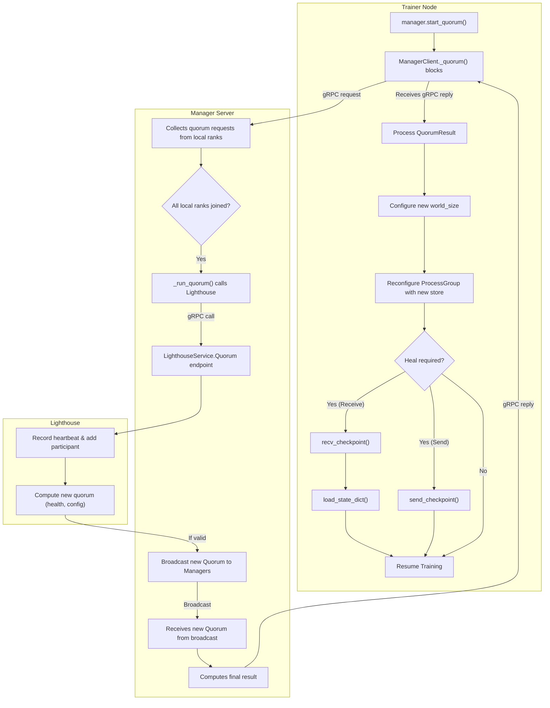

```mermaid
graph TD
    subgraph Trainer Node
        A1["manager.start_quorum()"] --> A2["ManagerClient._quorum() blocks"]
        A2 -- Receives gRPC reply --> P1["Process QuorumResult"]
        P1 --> P2["Configure new world_size"]
        P2 --> P3["Reconfigure ProcessGroup with new store"]
        P3 --> P4{"Heal required?"}
        P4 -- Yes (Send) --> P5["send_checkpoint()"]
        P4 -- Yes (Receive) --> P6["recv_checkpoint()"]
        P6 --> P7["load_state_dict()"]
        P7 --> P8["Resume Training"]
        P5 --> P8
        P4 -- No --> P8
    end

    subgraph Manager Server
        M1["Collects quorum requests from local ranks"] --> M2{"All local ranks joined?"}
        M2 -- Yes --> M3["_run_quorum() calls Lighthouse"]
        M3 -- gRPC call --> L1
        L4 -- Broadcast --> M4["Receives new Quorum from broadcast"]
        M4 --> M5["Computes final result"]
        M5 -- gRPC reply --> A2
    end

    subgraph Lighthouse
        L1["LighthouseService.Quorum endpoint"]
        L1 --> L2["Record heartbeat & add participant"]
        L2 --> L3["Compute new quorum (health, config)"]
        L3 -- If valid --> L4["Broadcast new Quorum to Managers"]
    end

    %% Define connections between subgraphs
    A2 -- gRPC request --> M1
```
